# 📱💾 KVIBE - Plan de Refonte Responsive & Données Réelles

**Instruction d'origine :** "Le site doit être full responsive design (en particulier pour notebook mac M2 et nous ne devons avoir que des données réelles. merci de tagguer toutes les pages précisant leur statut responsive design et statut des données. Merci de faire un état des lieux détaillé puis établir un plan de travail"

**Date :** 2025-09-14  
**Projet :** KVIBE MonoRepo Campaign Management Platform  
**Objectif :** Transformation complète responsive design + migration données réelles  

---

## 🔍 **AUDIT DÉTAILLÉ - ÉTAT DES LIEUX COMPLET**

### 📊 **MATRICE DE CONFORMITÉ**

| Composant | Status Responsive | Status Données | MacBook M2 | Priorité |
|---|---|---|---|---|
| **🏠 App.tsx (Navigation)** | 🔴 PROBLÉMATIQUE | ❌ MOCKÉES | 🔴 CRITIQUE | P0 |
| **👥 FoundingMembersTracker** | ✅ BON | ❌ FALLBACK | ✅ ACCEPTABLE | P1 |
| **📊 Analytics.tsx** | ✅ BON | ❌ STATIQUES | ✅ ACCEPTABLE | P1 |
| **⚙️ Settings.tsx** | 🔴 NON-CONFORME | ⚠️ MIXTE | 🔴 PROBLÉMATIQUE | P0 |
| **👥 Leads.tsx** | 🔴 NON-CONFORME | ❌ MOCKÉES | ⚠️ MOYEN | P0 |
| **✨ ContentGenerator.tsx** | 🔴 NON-CONFORME | ⚠️ FALLBACK | 🔴 PROBLÉMATIQUE | P0 |
| **🐦 TwitterChallenger.tsx** | 🔴 NON-CONFORME | ❌ STATIQUES | 🔴 PROBLÉMATIQUE | P1 |

### 🎯 **CIBLES RESPONSIVE SPÉCIFIQUES**

**MacBook Air M2 - Résolutions prioritaires :**
- **1440x900** (default) - Navigation compactée ❌
- **1680x1050** (scaled) - Layout optimal ✅
- **1920x1200** (external) - Desktop full ✅

**Breakpoints critiques :**
- Mobile : 375px-768px
- Tablet : 768px-1024px  
- MacBook : 1440px-1680px
- Desktop : 1920px+

### 🚨 **PROBLÈMES CRITIQUES IDENTIFIÉS**

#### **1. Navigation (App.tsx)**
```typescript
// 🔴 PROBLÈMES ACTUELS
- Pas de burger menu mobile
- Navigation inline fixe (déborde sur 1440px)
- Pas d'adaptation aux écrans intermédiaires
- Menu items sans responsive collapse
```

#### **2. Données 100% Mockées**
```typescript
// 🔴 FALLBACK SYSTÉMATIQUE
useApiData.ts:
- useDashboardStats() → fallback hardcodé (47 membres)
- useFoundingMembers() → Array.from({ length: 47 }) généré
- useLeads() → mockLeads statiques
- useContent() → contentFallback service
```

#### **3. Pages Non-Mobiles**
```typescript
// 🔴 INTERFACES FIXES
Settings.tsx: 708 lignes, formulaires rigides
Leads.tsx: table fixe, pas mobile-friendly  
ContentGenerator.tsx: forms complexes non-adaptés
TwitterChallenger.tsx: layouts rigides
```

---

## 🚀 **PLAN DE TRAVAIL EXÉCUTABLE**

### **PHASE 1 - CORRECTIONS CRITIQUES (P0) - 4-5 jours**

#### **🔧 1.1 Navigation Responsive** 
**Fichier :** `apps/dashboard/src/App.tsx`

```typescript
// ACTIONS IMMÉDIATES
✅ Implementer burger menu mobile
✅ Breakpoints MacBook M2 spécifiques
✅ Navigation collapsible
✅ Header adaptatif selon viewport

// IMPLÉMENTATION
const [mobileMenuOpen, setMobileMenuOpen] = useState(false);

// Responsive navigation avec Tailwind
<nav className="sticky top-0 z-40 bg-white border-b border-gray-100 shadow-sm">
  <div className="max-w-7xl mx-auto px-4 sm:px-6 lg:px-8">
    {/* Mobile burger + Desktop menu */}
    <div className="flex items-center justify-between h-20">
      {/* Logo + Mobile burger */}
      <div className="flex items-center">
        {/* Burger menu mobile */}
        <button 
          className="md:hidden p-2 rounded-lg"
          onClick={() => setMobileMenuOpen(!mobileMenuOpen)}
        >
          <Menu className="w-6 h-6" />
        </button>
        {/* Logo */}
      </div>
      
      {/* Desktop navigation */}
      <div className="hidden md:flex items-center gap-2">
        {menuItems.map((item) => ...)}
      </div>
    </div>
    
    {/* Mobile menu dropdown */}
    {mobileMenuOpen && (
      <div className="md:hidden border-t border-gray-100">
        {menuItems.map((item) => ...)}
      </div>
    )}
  </div>
</nav>
```

#### **🔧 1.2 Settings Refonte Mobile-First**
**Fichier :** `apps/dashboard/src/pages/Settings.tsx`

```typescript
// TRANSFORMATION 708 LIGNES → MODULAIRE
✅ Mobile-first design
✅ Formulaires stack vertical mobile
✅ Tabs responsive avec scroll horizontal
✅ API keys management sécurisé

// STRUCTURE RECOMMANDÉE
const SettingsTabs = [
  { id: 'api', label: 'API Keys', icon: Key },
  { id: 'services', label: 'Services', icon: Database },
  { id: 'notifications', label: 'Notifications', icon: Bell }
];

// Mobile tabs avec scroll horizontal
<div className="overflow-x-auto border-b border-gray-200">
  <nav className="flex space-x-8 min-w-max px-4">
    {SettingsTabs.map((tab) => (
      <button className="whitespace-nowrap py-4 px-1 border-b-2 text-sm font-medium">
        {tab.label}
      </button>
    ))}
  </nav>
</div>

// Formulaires stack mobile
<div className="space-y-6 lg:grid lg:grid-cols-2 lg:gap-6 lg:space-y-0">
  {/* Forms responsive */}
</div>
```

#### **🔧 1.3 Leads Page Mobile Cards**
**Fichier :** `apps/dashboard/src/pages/Leads.tsx`

```typescript
// TRANSFORMATION TABLE → CARDS RESPONSIVE
✅ Cards adaptatives mobile
✅ Table responsive desktop uniquement
✅ Filtres collapsibles
✅ Actions contextuelles mobile

// IMPLEMENTATION
// Mobile: Cards
<div className="block lg:hidden space-y-4">
  {leads.map((lead) => (
    <div className="bg-white rounded-lg border p-4">
      <div className="flex items-center justify-between mb-2">
        <h3 className="font-medium">{lead.name}</h3>
        <span className={`px-2 py-1 rounded-full text-xs ${getStatusColor(lead.status)}`}>
          {lead.status}
        </span>
      </div>
      <p className="text-sm text-gray-600">{lead.email}</p>
      <div className="flex items-center justify-between mt-3">
        <span className="text-sm">{lead.company}</span>
        <div className="flex space-x-2">
          <button className="p-1 text-blue-600">
            <Mail className="w-4 h-4" />
          </button>
          <button className="p-1 text-green-600">
            <Phone className="w-4 h-4" />
          </button>
        </div>
      </div>
    </div>
  ))}
</div>

// Desktop: Table
<div className="hidden lg:block overflow-x-auto">
  <table className="min-w-full">
    {/* Table normale */}
  </table>
</div>
```

#### **🔧 1.4 ContentGenerator Progressive**
**Fichier :** `apps/dashboard/src/pages/ContentGenerator.tsx`

```typescript
// WIZARD MULTI-STEP MOBILE
✅ Interface dense → Progressive disclosure
✅ Formulaires adaptatifs
✅ Preview responsive
✅ Historique optimisé mobile

// IMPLÉMENTATION WIZARD
const [currentStep, setCurrentStep] = useState(1);
const steps = [
  { id: 1, title: 'Platform', description: 'Choose your platform' },
  { id: 2, title: 'Content', description: 'Define your content' },
  { id: 3, title: 'Optimize', description: 'Optimize and generate' }
];

// Mobile wizard avec progress
<div className="lg:hidden">
  {/* Progress bar */}
  <div className="mb-6">
    <div className="flex items-center justify-between text-sm text-gray-600 mb-2">
      <span>Step {currentStep} of {steps.length}</span>
      <span>{Math.round((currentStep / steps.length) * 100)}%</span>
    </div>
    <div className="w-full bg-gray-200 rounded-full h-2">
      <div 
        className="bg-blue-600 h-2 rounded-full transition-all duration-300"
        style={{ width: `${(currentStep / steps.length) * 100}%` }}
      />
    </div>
  </div>
  
  {/* Step content */}
  {currentStep === 1 && <PlatformSelection />}
  {currentStep === 2 && <ContentInput />}
  {currentStep === 3 && <OptimizeGenerate />}
</div>
```

### **PHASE 2 - DONNÉES RÉELLES (P1) - 2-3 jours**

#### **🔧 2.1 API Backend Connection**
**Fichier :** `apps/dashboard/src/hooks/useApiData.ts`

```typescript
// REFONTE COMPLÈTE - ÉLIMINER FALLBACK
✅ Real-time API calls
✅ Error handling + retry logic
✅ Cache intelligent
✅ Loading states

// NOUVEAU PATTERN
export function useDashboardStats() {
  const [stats, setStats] = useState(null);
  const [loading, setLoading] = useState(true);
  const [error, setError] = useState(null);

  const fetchStats = useCallback(async () => {
    try {
      setLoading(true);
      setError(null);
      
      // VRAIE API - PAS DE FALLBACK
      const response = await fetch('/api/dashboard/stats');
      if (!response.ok) throw new Error('API Error');
      
      const data = await response.json();
      setStats(data);
    } catch (err) {
      setError(err);
      // LOG ERROR MAIS PAS DE FALLBACK
      console.error('Dashboard stats failed:', err);
    } finally {
      setLoading(false);
    }
  }, []);

  useEffect(() => {
    fetchStats();
    // Real-time polling
    const interval = setInterval(fetchStats, 30000);
    return () => clearInterval(interval);
  }, [fetchStats]);

  return { stats, loading, error, refetch: fetchStats };
}
```

#### **🔧 2.2 Database Schema Production**
**Fichier :** `apps/backend/migrations/create_real_data_schema.sql`

```sql
-- TABLES PRODUCTION RÉELLES
CREATE TABLE founding_members (
  id SERIAL PRIMARY KEY,
  email VARCHAR(255) UNIQUE NOT NULL,
  name VARCHAR(255),
  tier VARCHAR(50) NOT NULL CHECK (tier IN ('maker', 'startup', 'patron')),
  amount DECIMAL(10,2) NOT NULL,
  status VARCHAR(50) DEFAULT 'active',
  created_at TIMESTAMP DEFAULT NOW(),
  updated_at TIMESTAMP DEFAULT NOW()
);

CREATE TABLE leads (
  id SERIAL PRIMARY KEY,
  name VARCHAR(255) NOT NULL,
  email VARCHAR(255) UNIQUE NOT NULL,
  company VARCHAR(255),
  persona VARCHAR(50) CHECK (persona IN ('maker', 'startup', 'patron')),
  status VARCHAR(50) DEFAULT 'new' CHECK (status IN ('new', 'qualified', 'contacted', 'demo', 'negotiating', 'won', 'lost')),
  score INTEGER DEFAULT 0 CHECK (score >= 0 AND score <= 100),
  value DECIMAL(10,2) DEFAULT 0,
  source VARCHAR(100),
  tags JSONB DEFAULT '[]',
  created_at TIMESTAMP DEFAULT NOW(),
  updated_at TIMESTAMP DEFAULT NOW(),
  last_activity TIMESTAMP DEFAULT NOW()
);

CREATE TABLE content_generated (
  id SERIAL PRIMARY KEY,
  platform VARCHAR(50) NOT NULL,
  title VARCHAR(500),
  content TEXT NOT NULL,
  persona_target VARCHAR(50),
  status VARCHAR(50) DEFAULT 'draft',
  views INTEGER DEFAULT 0,
  engagement INTEGER DEFAULT 0,
  leads_generated INTEGER DEFAULT 0,
  conversions INTEGER DEFAULT 0,
  roi DECIMAL(5,2) DEFAULT 0,
  created_at TIMESTAMP DEFAULT NOW(),
  updated_at TIMESTAMP DEFAULT NOW()
);

-- Index pour performance
CREATE INDEX idx_founding_members_tier ON founding_members(tier);
CREATE INDEX idx_leads_status ON leads(status);
CREATE INDEX idx_leads_persona ON leads(persona);
CREATE INDEX idx_content_platform ON content_generated(platform);
CREATE INDEX idx_content_created_at ON content_generated(created_at);
```

#### **🔧 2.3 Backend API Routes Réelles**
**Fichier :** `apps/backend/src/routes/dashboard-routes.ts`

```typescript
// NOUVELLES ROUTES API RÉELLES
import { Router } from 'express';
import { Pool } from 'pg';

const router = Router();
const pool = new Pool({
  host: 'postgres-central.platform.svc.cluster.local',
  port: 5432,
  database: 'kvibes',
  user: 'postgres',
  password: 'postgres'
});

// STATS DASHBOARD RÉELLES
router.get('/stats', async (req, res) => {
  try {
    const [foundingMembers, leads, revenue] = await Promise.all([
      pool.query('SELECT COUNT(*), AVG(amount) FROM founding_members WHERE status = $1', ['active']),
      pool.query('SELECT COUNT(*) as total, COUNT(*) FILTER (WHERE status = $1) as qualified FROM leads', ['qualified']),
      pool.query('SELECT SUM(amount) as total FROM founding_members WHERE status = $1', ['active'])
    ]);

    res.json({
      foundingMembersCount: parseInt(foundingMembers.rows[0].count),
      avgDealSize: parseFloat(foundingMembers.rows[0].avg || 0),
      totalLeads: parseInt(leads.rows[0].total),
      qualifiedLeads: parseInt(leads.rows[0].qualified || 0),
      totalRevenue: parseFloat(revenue.rows[0].total || 0),
      conversionRate: leads.rows[0].total > 0 
        ? (foundingMembers.rows[0].count / leads.rows[0].total * 100).toFixed(1)
        : 0
    });
  } catch (error) {
    console.error('Dashboard stats error:', error);
    res.status(500).json({ error: 'Failed to fetch dashboard stats' });
  }
});

// FOUNDING MEMBERS RÉELS
router.get('/founding-members', async (req, res) => {
  try {
    const result = await pool.query(`
      SELECT id, email, name, tier, amount, created_at 
      FROM founding_members 
      WHERE status = $1 
      ORDER BY created_at DESC 
      LIMIT 100
    `, ['active']);

    res.json(result.rows);
  } catch (error) {
    console.error('Founding members error:', error);
    res.status(500).json({ error: 'Failed to fetch founding members' });
  }
});

// LEADS RÉELS
router.get('/leads', async (req, res) => {
  try {
    const { status, persona, limit = 50, offset = 0 } = req.query;
    
    let query = 'SELECT * FROM leads WHERE 1=1';
    const params = [];
    let paramCount = 0;

    if (status) {
      query += ` AND status = $${++paramCount}`;
      params.push(status);
    }
    
    if (persona) {
      query += ` AND persona = $${++paramCount}`;
      params.push(persona);
    }

    query += ` ORDER BY created_at DESC LIMIT $${++paramCount} OFFSET $${++paramCount}`;
    params.push(limit, offset);

    const result = await pool.query(query, params);
    res.json(result.rows);
  } catch (error) {
    console.error('Leads error:', error);
    res.status(500).json({ error: 'Failed to fetch leads' });
  }
});

export default router;
```

### **PHASE 3 - OPTIMISATIONS MacBook M2 (P3) - 1 jour**

#### **🔧 3.1 Breakpoints Spécifiques**
**Fichier :** `apps/dashboard/tailwind.config.js`

```javascript
// CONFIGURATION TAILWIND MACBOOK M2
module.exports = {
  theme: {
    extend: {
      screens: {
        'macbook-air': '1440px',    // MacBook Air M2 default
        'macbook-pro': '1680px',    // MacBook Pro scaled  
        'external-4k': '1920px'     // External monitor
      },
      spacing: {
        'safe': '1rem',  // Safe area pour MacBook notch
      }
    }
  }
}
```

#### **🔧 3.2 Navigation MacBook Optimized**
**Fichier :** `apps/dashboard/src/App.tsx`

```typescript
// NAVIGATION ADAPTÉE MACBOOK M2
<nav className="sticky top-0 z-40 bg-white border-b border-gray-100 shadow-sm">
  <div className="max-w-7xl mx-auto px-4 sm:px-6 lg:px-8">
    <div className="flex items-center justify-between h-16 macbook-air:h-20">
      {/* Logo adaptatif */}
      <div className="flex items-center">
        <div className="flex items-center gap-2 macbook-air:gap-3">
          <div className="w-8 h-8 macbook-air:w-10 macbook-air:h-10 bg-gradient-to-r from-blue-600 to-purple-600 rounded-xl flex items-center justify-center">
            <Zap className="w-4 h-4 macbook-air:w-6 macbook-air:h-6 text-white" />
          </div>
          <div>
            <div className="font-bold text-lg macbook-air:text-xl text-gray-900">K-VIBE</div>
            <div className="text-xs text-gray-500 -mt-1 hidden macbook-air:block">
              OnlyOneAPI Campaign Control
            </div>
          </div>
        </div>
      </div>
      
      {/* Navigation compacte → expansive */}
      <div className="flex items-center gap-1 macbook-air:gap-2">
        {menuItems.map((item) => {
          const Icon = item.icon;
          return (
            <button
              key={item.id}
              onClick={() => setCurrentPage(item.id as any)}
              className={`flex items-center gap-1 macbook-air:gap-2 px-2 macbook-air:px-4 py-2 rounded-lg text-sm macbook-air:text-base font-medium transition-colors ${
                currentPage === item.id
                  ? 'bg-blue-600 text-white'
                  : 'text-gray-700 hover:text-blue-600 hover:bg-blue-50'
              }`}
            >
              <Icon className="w-4 h-4" />
              <span className="hidden macbook-air:inline">{item.label}</span>
            </button>
          );
        })}
      </div>
    </div>
  </div>
</nav>
```

### **PHASE 4 - PERFORMANCE & UX POLISH (P4) - 1 jour**

#### **🔧 4.1 Loading States & Skeletons**
**Fichier :** `apps/dashboard/src/components/LoadingStates.tsx`

```typescript
// SKELETON COMPONENTS RESPONSIVE
export const DashboardCardSkeleton = () => (
  <div className="bg-white rounded-2xl p-4 macbook-air:p-6 shadow-xl border border-white/50 animate-pulse">
    <div className="flex items-center justify-between mb-4">
      <div className="w-10 h-10 macbook-air:w-12 macbook-air:h-12 bg-gray-200 rounded-lg" />
      <div className="w-16 h-6 bg-gray-200 rounded-full" />
    </div>
    <div className="w-20 h-8 macbook-air:h-9 bg-gray-200 rounded mb-2" />
    <div className="w-24 h-4 bg-gray-200 rounded" />
  </div>
);

export const TableRowSkeleton = () => (
  <tr className="animate-pulse">
    <td className="py-3"><div className="w-32 h-4 bg-gray-200 rounded" /></td>
    <td className="py-3"><div className="w-24 h-4 bg-gray-200 rounded" /></td>
    <td className="py-3"><div className="w-16 h-6 bg-gray-200 rounded-full" /></td>
    <td className="py-3"><div className="w-20 h-4 bg-gray-200 rounded" /></td>
  </tr>
);
```

#### **🔧 4.2 Error Boundaries & Retry Logic**
**Fichier :** `apps/dashboard/src/components/ErrorBoundary.tsx`

```typescript
// ERROR HANDLING ROBUSTE
export const APIErrorFallback = ({ error, retry }: { error: Error, retry: () => void }) => (
  <div className="bg-red-50 border border-red-200 rounded-lg p-4 macbook-air:p-6">
    <div className="flex items-center gap-3 mb-3">
      <AlertCircle className="w-5 h-5 text-red-600" />
      <h3 className="font-medium text-red-900">Connection Error</h3>
    </div>
    <p className="text-sm text-red-700 mb-4">
      Unable to load real-time data. Please check your connection.
    </p>
    <button 
      onClick={retry}
      className="bg-red-600 text-white px-4 py-2 rounded-lg text-sm font-medium hover:bg-red-700 transition-colors"
    >
      Retry
    </button>
  </div>
);
```

---

## 📊 **ESTIMATION & PLANNING**

### **EFFORT DÉTAILLÉ**

| Phase | Composants | Effort | Durée | Risque |
|---|---|---|---|---|
| **P0 - Navigation** | App.tsx refonte | 🔴 ÉLEVÉ | 1 jour | MOYEN |
| **P0 - Settings** | Mobile-first 708L | 🔴 ÉLEVÉ | 1.5 jours | MOYEN |
| **P0 - Leads/Content** | Cards + wizard | 🔴 ÉLEVÉ | 1.5 jours | MOYEN |
| **P1 - API Réelles** | Backend + hooks | 🟠 MOYEN | 1.5 jours | ÉLEVÉ |
| **P1 - Database** | Schema + migration | 🟠 MOYEN | 0.5 jours | FAIBLE |
| **P3 - MacBook M2** | Breakpoints optim | 🟢 FAIBLE | 0.5 jours | FAIBLE |
| **P4 - UX Polish** | Loading + errors | 🟢 FAIBLE | 0.5 jours | FAIBLE |

**TOTAL ESTIMÉ : 6-7 jours**

### **ORDRE D'EXÉCUTION CRITIQUE**

```mermaid
gantt
    title KVIBE Responsive & Real Data Implementation
    dateFormat X
    axisFormat %d

    section Phase 0 (Critical)
    Navigation Responsive    :p0-nav, 0, 1d
    Settings Mobile-First    :p0-set, after p0-nav, 1.5d
    Leads/Content Cards      :p0-page, after p0-nav, 1.5d

    section Phase 1 (Data)
    Database Schema          :p1-db, 0, 0.5d
    API Backend Routes       :p1-api, after p1-db, 1d
    Frontend API Integration :p1-front, after p1-api, 1d

    section Phase 3 (Optimization)
    MacBook M2 Breakpoints   :p3-mac, after p0-set, 0.5d

    section Phase 4 (Polish)
    Loading States & UX      :p4-ux, after p1-front, 0.5d
```



### **SUCCESS CRITERIA**

✅ **Responsive Design**
- [ ] Navigation burger menu fonctionnel
- [ ] Toutes pages mobile-first (375px+)
- [ ] MacBook M2 (1440px) optimisé
- [ ] Breakpoints adaptatifs

✅ **Données Réelles**  
- [ ] 0% fallback/mock data
- [ ] API backend connectée PostgreSQL cluster
- [ ] Real-time updates fonctionnels
- [ ] Error handling robuste

✅ **Performance**
- [ ] Loading states partout
- [ ] <200ms API response time
- [ ] Smooth transitions
- [ ] Progressive loading

### **RISQUES & MITIGATIONS**

🚨 **Risque ÉLEVÉ :** API Backend instabilité
**Mitigation :** Tests API complets + retry logic + monitoring

⚠️ **Risque MOYEN :** Responsive complexity
**Mitigation :** Mobile-first approach + progressive enhancement

✅ **Risque FAIBLE :** MacBook M2 compatibility
**Mitigation :** Breakpoints testés + fallbacks

---

## 🎯 **VALIDATION & TESTS**

### **Test Plan Responsive**
```bash
# Automated responsive testing
npm run test:responsive
# Tests breakpoints 375px, 768px, 1024px, 1440px, 1680px, 1920px

# Manual MacBook M2 validation
# Test sur MacBook Air M2 real device
# Validation 1440x900, 1680x1050, 1920x1200
```

### **Test Plan Données Réelles**
```bash
# API integration tests
npm run test:api:integration
# Test all API endpoints with real database

# Data validation tests  
npm run test:data:validation
# Verify no mock/fallback data in production
```

---

**🏁 READY TO EXECUTE - Plan validé et prêt à l'implémentation**

---

*Artefact NEXIA | KVIBE Responsive & Real Data | 2025-09-14*