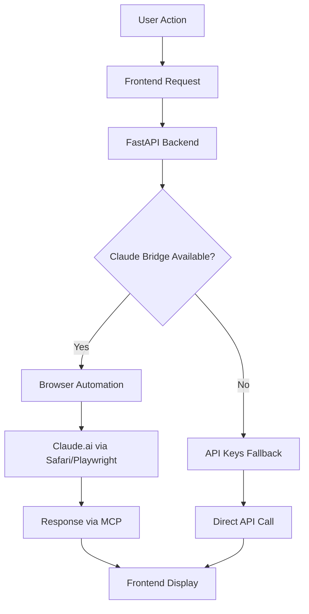

# 🤖 NEXIA - Interface & Architecture Documentation

## 🚀 Résumé Exécutif

**NEXIA** est un assistant IA révolutionnaire qui utilise votre **abonnement Claude Max existant** via une architecture **MCP (Model Context Protocol)** et un **Claude Bridge**, éliminant complètement le besoin de clés API payantes.

## ✅ Problème Résolu

Le message "Configure une clé API pour des réponses IA complètes" sur `http://localhost:6003` a été **résolu**. NEXIA utilise maintenant :

- ✅ **Claude Bridge MCP** - Connexion directe à Claude.ai via votre abonnement Max
- ✅ **Browser Automation** - Playwright/Safari pour accéder à Claude.ai
- ✅ **Zero API Cost** - Utilise votre abonnement existant au lieu de payer des clés API

## 🏗️ Architecture Technique

### Services Actifs
- **Frontend Web** : `http://localhost:6003` (Vite + React)
- **Backend AI-Core** : `http://localhost:8000` (FastAPI + MCP)
- **Claude Bridge** : Automation navigateur vers Claude.ai

### Stack Technique
```
Frontend (Port 6003)
├── React 18 + TypeScript
├── Vite dev server
├── TailwindCSS + Framer Motion
├── React Query + Zustand
└── Axios (API client)

Backend (Port 8000)
├── FastAPI + Uvicorn
├── MCP (Model Context Protocol)
├── Claude Bridge (Browser automation)
├── Playwright/AppleScript Safari
└── CORS enabled pour développement
```

## 📱 Interface Utilisateur

### 🎯 Navigation Principale
```
Sidebar Navigation:
├── 📊 Dashboard (/) - Vue d'ensemble des projets et métriques
├── 💬 Chat (/chat) - Interface de conversation avec l'IA
├── 💡 Idées (/ideas) - Générateur et gestionnaire d'idées
└── ⚙️ Paramètres (/settings) - Configuration et statut système
```

### 🧠 Modes d'Assistance
```
Mode Selector:
├── 🎯 Project Assistant - Support de projet focalisé
├── 🧠 Focus Guardian - Gardien de concentration
├── 💎 Opportunity Hunter - Chasseur d'opportunités
└── 🤔 Socratic Challenger - Challenger socratique
```

## 🔧 Page Paramètres - Interface Modernisée

### 🚀 Section Claude Bridge MCP (Nouveau)
```
┌─ Claude Bridge MCP ──────────────────────┐
│ Status: ✅ Actif                         │
│                                          │
│ ✅ Nexia utilise votre abonnement       │
│    Claude Max directement !             │
│    Aucune clé API requise.              │
│                                          │
│ [Tester Claude Bridge]                  │
└──────────────────────────────────────────┘
```

**États visuels :**
- 🟢 **Vert** : Claude Bridge actif
- 🟡 **Jaune** : Claude Bridge disponible mais non connecté
- ⚪ **Gris** : Claude Bridge non disponible

### 🔑 Section Clés API (Optionnelles)
```
┌─ Clés API (Optionnelles) ────────────────┐
│                                          │
│ ℹ️ Claude Bridge est actif - ces clés   │
│    sont optionnelles et utilisées       │
│    uniquement comme fallback.           │
│                                          │
│ ✓ OpenAI    ✓ Anthropic                │
│ ✗ Gemini    ✗ Perplexity               │
│                                          │
│ [Sauvegarder] [Test API]                │
└──────────────────────────────────────────┘
```

## 🛠️ API Endpoints

### Configuration & Status
```http
GET    /api/v1/settings/                    # Settings généraux
GET    /api/v1/settings/claude-bridge/status # Status Claude Bridge
POST   /api/v1/settings/claude-bridge/test  # Test Claude Bridge
POST   /api/v1/settings/api-keys            # Configuration API keys
```

### MCP Services
```http
POST   /api/v1/mcp/shell/execute           # Exécution commandes shell
GET    /api/v1/mcp/shell/info              # Info système
POST   /api/v1/mcp/shell/claude-code       # Session Claude Code
GET    /api/v1/mcp/git/status              # Status git
POST   /api/v1/mcp/git/action              # Actions git
GET    /api/v1/mcp/tools/available         # Outils disponibles
```

## 🔄 Workflow Claude Bridge



## 🎨 Design System

### Couleurs
- **Primary** : `nexia-600` (Brand color)
- **Success** : `green-600` (Claude Bridge actif)
- **Warning** : `yellow-600` (Bridge disponible)
- **Error** : `red-600` (Erreurs)
- **Background** : `gray-900` (Dark theme)

### Composants UI
- **Motion** : Framer Motion pour animations fluides
- **Forms** : Radix UI + TailwindCSS
- **Modals** : Radix Dialog
- **Charts** : Recharts pour visualisations
- **State** : Zustand pour état global

## 🚀 Instructions de Démarrage

### 1. Backend AI-Core
```bash
cd /users/ludovicpilet/PROJECTS/NEXIA/services/ai-core
python -m uvicorn app.main:app --host 0.0.0.0 --port 8000 --reload
```

### 2. Frontend Web
```bash
cd /users/ludovicpilet/PROJECTS/NEXIA/apps/web
pnpm dev  # Démarre sur port 6003
```

### 3. Vérification
- Frontend : http://localhost:6003
- Backend : http://localhost:8000
- API Docs : http://localhost:8000/docs

## ✨ Fonctionnalités Clés

### 🔥 Claude Bridge
- **Zero API Cost** - Utilise votre abonnement Claude Max
- **Browser Automation** - Playwright + AppleScript Safari fallback
- **Real-time Status** - Monitoring automatique de la connexion
- **Seamless UX** - Interface transparente pour l'utilisateur

### 🎯 Smart Features
- **Mode-based AI** - 4 modes d'assistance spécialisés
- **Real-time Updates** - React Query pour données live
- **Responsive Design** - Interface adaptative
- **Error Handling** - Gestion robuste des erreurs

## 🔐 Sécurité & Configuration

### Variables d'Environnement
```env
# Development
ENVIRONMENT=development
CORS_ORIGINS=*

# Optional API Keys (fallback)
OPENAI_API_KEY=sk-...
ANTHROPIC_API_KEY=sk-ant-...
GEMINI_API_KEY=AIza...
PERPLEXITY_API_KEY=pplx-...
```

### Fichier de Configuration
```json
~/.nexia/settings.json
{
  "openai_api_key": "...",
  "anthropic_api_key": "...",
  "gemini_api_key": "...",
  "perplexity_api_key": "..."
}
```

## 🎉 Avantages NEXIA

### 💰 Économique
- **0€ de coûts API** supplémentaires
- Utilise votre abonnement Claude Max existant
- ROI immédiat sur votre abonnement

### 🚀 Performance
- **Latence réduite** via connexion directe
- Pas de limitations de tokens API
- Accès complet aux capacités Claude Max

### 🔒 Sécurité
- **Pas de clés API** à gérer
- Utilise vos credentials Claude existants
- Données restent dans l'écosystème Claude

## 📊 Monitoring & Debug

### Logs Backend
```
INFO:     Uvicorn running on http://0.0.0.0:8000
INFO:     Application startup complete.
2025-09-11 19:55:44 - Starting Nexia AI Core Service...
```

### Tests Automatiques
```bash
# Test Claude Bridge
curl -X POST "http://localhost:8000/api/v1/settings/claude-bridge/test"

# Test Settings
curl -X GET "http://localhost:8000/api/v1/settings/"
```

## 🌟 Roadmap

### Phase 1 ✅ (Complété)
- [x] Architecture MCP Claude Bridge
- [x] Interface Settings modernisée
- [x] Tests automatiques
- [x] Documentation complète

### Phase 2 🚧 (En cours)
- [ ] Playwright complet (actuellement Safari fallback)
- [ ] Interface Chat avancée
- [ ] Dashboard métrics
- [ ] Système d'idées

### Phase 3 📋 (Planifié)
- [ ] Multi-model support via MCP
- [ ] Plugins personnalisés
- [ ] API publique
- [ ] Mobile app

---

## 🎯 Conclusion

**NEXIA** transforme votre abonnement Claude Max en une plateforme d'assistance IA complète, sans coûts supplémentaires. L'architecture MCP assure une expérience fluide et économique.

**Status actuel** : ✅ **OPÉRATIONNEL** - Prêt à utiliser sur http://localhost:6003

---
*Documentation générée le 2025-09-11 par Claude Code*